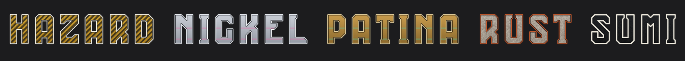
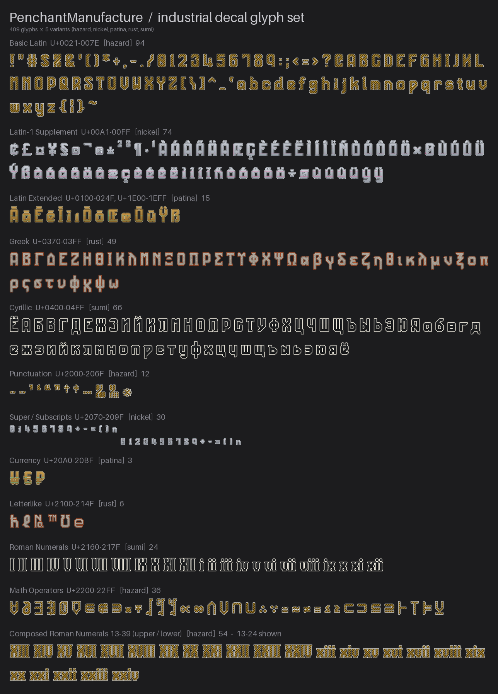

# PenchantManufacture ImageAssets



各種SNSおよびチャットサービス（Discord・Misskeyなど）向けに、**RadianN_kswg / ラジアン（柏木主税）による独自フォント PenchantManufacture** と **Claude による Agent 機能** によって制作するカスタム画像アセット／グリフ素材集です。

姉妹プロジェクト **Secvier_ImageAssets** と同じ設計思想・命名規則・ビルドフローを踏襲しています。本リポジトリは現時点では、フォントグリフを起点とした画像アセット生成パイプラインの **初期設定** を収録しています。

> **著作権者**: RadianN_kswg / ラジアン（柏木主税）
> **ライセンス**: [CC BY 4.0](https://creativecommons.org/licenses/by/4.0/deed.ja)

### 収録グリフ一覧（工業デカール）

ラテン・ギリシャ・キリル・数学記号・ローマ数字までを、5 種の工業デカール
（hazard / nickel / patina / rust / sumi）で統一した作風で収録しています。
下図は Unicode ブロック別の収録内容で、ブロックごとに異なるバリアントを表示しています。



---

## フォント収録グリフ

`_original-fonts/penchant-manufacture_v4.0-release/収録グリフ.txt` に記載の作者公式グリフ:

| カテゴリ                 | 内容                                                                 | 字数 |
| ------------------------ | -------------------------------------------------------------------- | ---- |
| ASCII可視記号ほか        | `U+0021`–`U+007E`（記号・数字・英大文字・英小文字）                  | 94   |
| ギリシャ大文字／小文字   | Α–Ω ／ α–ω（終シグマ ς 含む）                                        | 49   |
| キリル大文字／小文字     | А–Я ／ а–я（Ё ё 含む）                                               | 66   |
| ラテン拡張 大文字／小文字 | À Á Â Ã Ä Å Ç È É Ê Ë Ì Í Î Ï Ñ Ò Ó Ô Õ Ö Ø Ù Ú Û Ü Ý Ÿ Ā Ē Ī Ō Ū とその小文字 | 66   |
| 合字・特殊               | Æ æ Œ œ ẞ ß ı                                                        | 7    |
| 上付き／下付き           | ⁰–⁹ ⁱ ⁿ ⁺ ⁻ ⁼ ⁽ ⁾ ／ ₀–₉ ₙ ₊ ₋ ₌ ₍ ₎                                 | 33   |
| 数式・科学記号           | × ÷ ± ∓ ℓ ℧ ℏ ℮ √ ∛ ∜ ≈ ≠ ≤ ≥ ∞ ∂ ∇ ∈ ∉ ∋ ⊂ ⊃ ⊆ ⊇ ∩ ∪ ∴ ∵ ∝ ≡ ≅ ∅    | 33   |
| 論理・証明記号           | ∀ ∃ ∄ ¬ ∧ ∨ ⊻ ⊤ ⊢ ⊨ ∎                                                | 11   |
| 参照・校正／通貨／可読補助 | © ® ※ ¶ § № † ‡ ™ ／ ¥ € £ ¢ ₩ ₽ ¤ ／ · … ‰ ‱ – —                   | 22   |
| ローマ数字               | Ⅰ–Ⅻ ／ ⅰ–ⅻ（13〜39 は合成デカールとして別途生成）                   | 24   |
| 曲がり引用符             | ' ' " "（U+2018 U+2019 U+201C U+201D）                               | 4    |

| 項目              | 値                                    |
| ----------------- | ------------------------------------- |
| フォント名        | PenchantManufacture (Regular)         |
| リリース          | v4.0-release (2026-09-10)             |
| バージョン        | Version 1.010 (Fontself Maker 3.6.12) |
| Units per em      | 1000                                  |
| cmap マッピング数 | 415                                   |
| 実グリフ数        | 416                                   |

> **v4.0-release での変更**: `w` `ω` とローマ数字 `Ⅸ Ⅹ Ⅺ Ⅻ` / `ⅸ ⅹ ⅺ ⅻ` の字形が
> 変更・改善されました。収録字・絵文字点数（2252）は v4.0-beta と同じです。
> 各版の変更履歴と配置契約（OS/2 win 帯 [−198, 793] をそのまま信頼するクロップ）の
> 詳細は [AGENTS.md](AGENTS.md) を参照してください。

抽出スクリプトは cmap 全コードポイント（415）を走査し、**同一グリフへ再マップされた
コードポイントを 1 枚に統合**します（v3.2 以降は再マップ 0 件のため正規グリフ **409 字**を
SVG 化。統合した異体字は `docs/glyph_aliases.json` に検索エイリアスとして記録）。
さらに工業デカール生成では、絵文字サイズで描画が完全一致する同形字 13 字を 9 グループへ
出力 PNG 上で統合し、**絵文字は正味 396 字**になります（統合表
`docs/glyph_render_merges.json`。ソース SVG の 409 字は温存）。この 2 段の重複排除により、
**同一画像が別名で二重登録されることを防ぎます**。

---

## ディレクトリ構成

姉妹プロジェクト **Secvier** のビルド構成（`dist/{カテゴリ}/{バリアント}/` ＋
`_exported-dist/` の Misskey 一括インポート zip）に揃えています。

```
PenchantManufacture_ImageAssets/
├── aiscript/
│   └── penchant-string-converter.is # 文字列→工業デカールMFM変換ツール（対応表は自動生成）
├── assets/
│   └── fonts/
│       └── PenchantManufacture.otf   # ビルドで参照するフォント
├── src/
│   └── glyphs/                       # グリフ SVG 148字（アウトライン化済み）
├── dist/
│   ├── glyphs/                       # グリフ透過PNG（72px / 512px、装飾なし）
│   ├── glyphs_decal/{variant}/       # 工業デカール 幅可変PNG（Misskey向け・マスター）
│   └── glyphs_decal_square/{variant}/ # 工業デカール 正方形PNG（Discord向け）
├── svg2png/
│   └── glyphs/                       # SVG の単純PNG変換（装飾なし）
├── scripts/
│   ├── inspect_font.py               # フォントグリフ検査
│   ├── extract_glyphs.py             # フォント → SVGアウトライン抽出（重複排除）
│   ├── export_png.py                 # SVG → PNG 変換
│   ├── generate_decal.py             # 工業デカール生成（幅可変＋正方形／描画一致統合）
│   ├── generate_aiscript.py          # aiscript/*.is の対応表を再生成
│   ├── build_misskey_zip.py          # Misskey一括インポートzip生成
│   └── build.py                      # 全ステップ一括ビルド
├── docs/
│   ├── glyph_map.txt                 # inspect_font.py が自動生成
│   ├── glyph_aliases.json            # 異体字→正規グリフ 対応表
│   ├── glyph_render_merges.json      # 描画一致グリフ 統合表
│   ├── AISCRIPT_CONVERTER.md          # 文字列コンバーター導入・変換仕様
│   └── DECAL_VARIANTS.md             # 工業デカール バリアント仕様
├── _original-fonts/                  # 原本フォント（読み取り専用・.gitignore対象）
├── _exported-dist/                   # エクスポートzip格納（.gitignore対象）
├── requirements.txt
├── .gitattributes
├── LICENSE
├── AGENTS.md                         # エージェント共通指示書
└── CLAUDE.md                         # Claude 向け補足
```

variant = `sumi`（墨・**既定**／二画面）/ `rust`（酸鉄）/ `hazard`（警戒）/ `patina`（緑青真鍮）/ `nickel`（白銅燐光）

---

## セットアップ

### 必要環境

- Python 3.11+
- 依存ライブラリ（`requirements.txt` 参照）
- libcairo（`cairosvg` が使用。pip では入りません）

```bash
pip install -r requirements.txt
```

macOS（Homebrew）では libcairo を入れ、Homebrew のライブラリを探索先に加えてから実行します
（`/opt/homebrew/lib` は既定のライブラリ探索先に含まれないため）。

```bash
brew install cairo
export DYLD_FALLBACK_LIBRARY_PATH=/opt/homebrew/lib
```

### グリフアセットの生成

```bash
# フォント検査 → docs/glyph_map.txt
python scripts/inspect_font.py

# グリフSVG抽出（重複排除。まず対象確認 → 書き出し） → src/glyphs/, docs/glyph_aliases.json
python scripts/extract_glyphs.py --dry-run
python scripts/extract_glyphs.py

# SVG → PNG変換 → dist/glyphs/, svg2png/glyphs/
python scripts/export_png.py

# 工業デカール生成（幅可変＋正方形／描画一致統合） → dist/glyphs_decal[_square]/
python scripts/generate_decal.py

# 文字列コンバーターの対応表を再生成 → aiscript/penchant-string-converter.is
python scripts/generate_aiscript.py

# Misskey一括インポートzip → _exported-dist/
python scripts/build_misskey_zip.py

# 全ステップ一括ビルド（dry-run確認 → 実行）
python scripts/build.py --dry-run
python scripts/build.py
```

### SNS カスタム絵文字の登録

- **Misskey**: `_exported-dist/penchant-misskey-*.zip` を管理画面から一括インポート
  （非正方形をそのまま扱えるため幅可変版を収録。カテゴリ・エイリアス付き）。
- **Discord**: `dist/glyphs_decal_square/{variant}/*_128.png` を個別アップロード
  （正方形スロット向け。1ファイル 256KB 以下）。

### Misskey用文字列コンバーター

[`aiscript/penchant-string-converter.is`](aiscript/penchant-string-converter.is) は、
任意の文字列を登録済みのPenchantManufacture工業デカール絵文字のMFMへ変換する
AiScript 1.2.1対応ツールです。5バリアントの選択、スペーサ（`:gapp:` / `:spcp:`）、
字詰め済みローマ数字13～39（大小）、未収録文字の赤太字エラー表示に対応します。
変換表は `python scripts/build.py --step aiscript` でビルド成果物から再生成されます。

導入方法と変換仕様は
[`docs/AISCRIPT_CONVERTER.md`](docs/AISCRIPT_CONVERTER.md)を参照してください。

---

## 出力仕様

| 項目               | 仕様                                                       |
| ------------------ | ---------------------------------------------------------- |
| フォーマット       | PNG（RGBA）                                                 |
| グリフ SVG         | viewBox `0 0 512 512`、アウトライン化                       |
| グリフ PNG（装飾なし） | 72 × 72 px / 512 × 512 px                               |
| デカール（Misskey） | 高さ 512 / 128 px・**幅可変**（字面比率を維持）            |
| デカール（Discord） | 512 / 128 px の**正方形**（中央寄せパディング）           |
| 背景               | 透過（alpha）                                              |
| カラーモード       | sRGB                                                       |

ファイル命名: `char_{AGL名}_{コードポイント}.svg`（例: `char_A_0041.svg`, `char_Alpha_0391.svg`）。
末尾のコードポイントにより、case-insensitive なファイルシステムでも大文字/小文字グリフが衝突しません。

---

## クレジット

### フォント

**PenchantManufacture** — RadianN_kswg / ラジアン（柏木主税）による独自作字フォント。
本リポジトリの画像アセットはこのフォントのグリフをベースに制作されています。

### 生成ツール

**Claude（Anthropic）** — Agent 機能を使用してアセットの設計・スクリプト生成を行っています。
本プロジェクトの制作は Claude Cowork による自律エージェント作業によって実施されました。

---

## ライセンス

本アセット群（PenchantManufacture フォントグリフ派生部分および独自デザイン部分）は
**CC BY 4.0** で公開されています。

**[Creative Commons 表示 4.0 国際](https://creativecommons.org/licenses/by/4.0/deed.ja)**

著作者：RadianN_kswg / ラジアン（柏木主税）

利用時のクレジット表記例:

```
PenchantManufacture image assets by RadianN_kswg / ラジアン（柏木主税）
CC BY 4.0 https://creativecommons.org/licenses/by/4.0/
```
